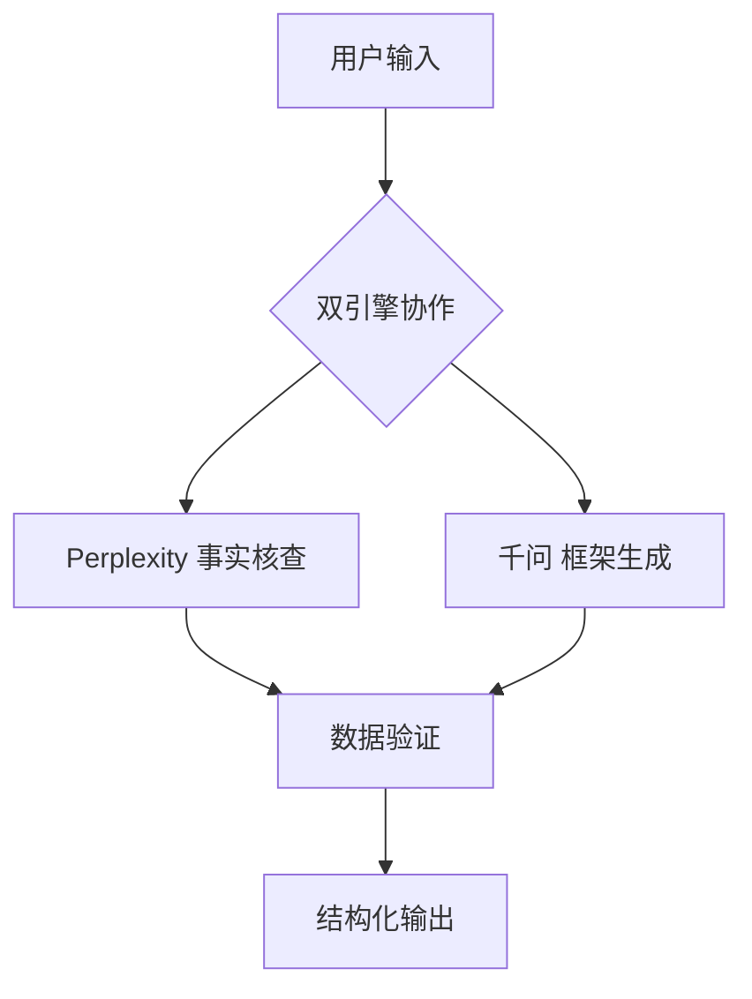

# 智库小助手 (dxAI)

[](https://opensource.org/licenses/MIT)


智能写作助手，集成通义千问与Perplexity双引擎，专为政策研究与行业分析打造的AI协作工具。

## 🚀 核心优势

- 🔍 **精准检索** - Perplexity实时网络数据验证
- 🧠 **深度分析** - 千问大模型逻辑推演
- 📑 **格式规范** - 自动生成智库标准文档
- ⚡ **高效迭代** - 支持多轮对话优化

## 🛠️ 技术架构



## 🧬 运作原理

### 双引擎协作流程
```python
# dx_assistant.py 核心处理逻辑
def analyze(self, title: str, thoughts: str) -> str:
    # 1. Perplexity事实核查
    search_result = self.search_tool.run(title)  # 调用sonar模型
    
    # 2. 千问框架生成
    prompt = self._build_prompt(title, thoughts, search_result)
    result = self.llm.generate(prompt)  # 调用qwen-max模型
    
    # 3. 结构化输出
    return self._format_output(result)
```

### 关键技术实现
1. **实时数据验证层**
```python
# tools/search.py Perplexity调用
response = httpx.post(
    "https://api.perplexity.ai/chat/completions",
    json={
        "model": "sonar",
        "messages": [{
            "role": "user", 
            "content": f"行业最新数据+权威来源:{query}"
        }]
    }
+)
```

2. **深度分析层**
```python
# llm/qwen.py 千问初始化
self.llm = QwenLLM(model_name="qwen-max", temperature=0.5)
```

## 📦 快速开始

```bash
# 1. 安装依赖 (建议使用Python 3.8+)
pip install -r requirements.txt

# 2. 配置密钥 (.env文件)
echo "DASHSCOPE_API_KEY=您的千问API密钥" >> .env
echo "PERPLEXITY_API_KEY=您的Perplexity密钥" >> .env

# 3. 启动交互界面
streamlit run main.py
```

## 🔄 典型工作流

```python
from dx_assistant import DXAssistant

# 初始化双引擎
analyst = DXAssistant()

# 执行分析任务
report = analyst.analyze(
    title="新能源汽车产业政策分析",
    thoughts="""重点分析：
    1. 各国政策对比
    2. 技术路线差异
    3. 市场影响预测
    4. 典型案例研究"""
)
```

## 📌 版本特性

**v2.1** 主要升级：
- 新增Perplexity事实核查引擎
- 优化多轮对话记忆机制
- 支持Markdown/HTML/PDF输出
- 增加API调用频率限制

## 🌍 应用场景

```python
# 政策分析
title = "数据跨境流动监管政策研究"

# 行业研究  
title = "全球AI芯片市场竞争格局分析"

# 技术评估
title = "大模型多模态能力演进路径"
```

## 📄 生成示例

```markdown
## 三、市场发展现状 (2023-2024)
- 全球市场规模：预计从$15亿(2023)增长至$72亿(2028)，CAGR 37%
- 核心驱动因素：
  - AI应用需求激增 (IDC报告显示向量查询量年增420%)
  - 云原生架构普及 (AWS Q1财报显示向量数据库使用量增长278%)
- 典型应用场景：
  ▶️ 推荐系统 (Pinterest案例: CTR提升34%)
  ▶️ 语义搜索 (Notion用户报告搜索效率提升65%) 
```

## ⚠️ 注意事项

1. API配置
- 千问API需申请商用权限
- Perplexity建议使用`sonar`模型

2. 数据安全
- 敏感内容建议本地化处理
- 网络请求自动缓存至`./cache`

## 🌱 贡献指南

欢迎通过以下方式参与：
1. 提交典型分析案例到`examples/`
2. 完善行业术语词典`resources/glossary.csv`
3. 优化prompt模板`prompts/`

## 📅 路线图

- [ ] Q3 2024: 多语言支持
- [ ] Q4 2024: 本地知识库集成
- [ ] Q1 2025: 自动数据可视化

## 📁 项目结构
```
dxAI/
├── dx_assistant.py   # 双引擎协调器
├── llm/             
│   └── qwen.py       # 千问大模型接口
├── tools/
│   └── search.py     # Perplexity搜索工具
└── config.py         # 双引擎配置
```